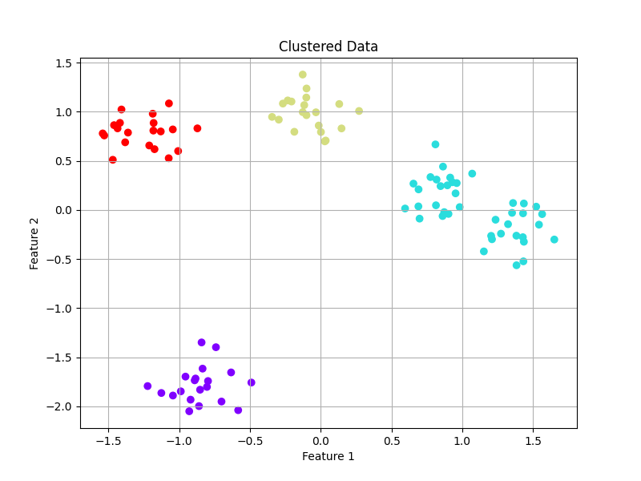
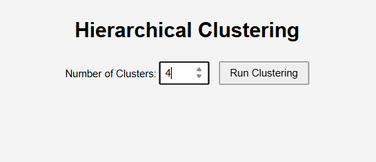
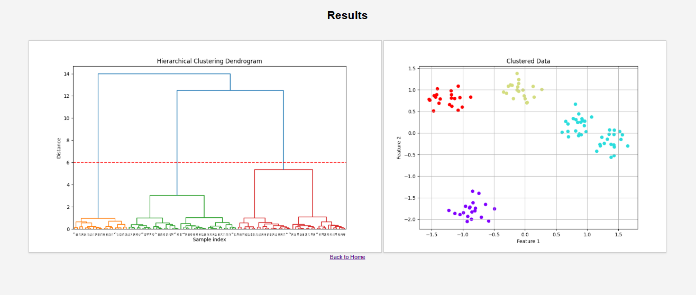

# 📊 Hierarchical Clustering with Dendrogram & Cluster Visualization

This project demonstrates how to perform **Hierarchical Clustering** on synthetic data using the **Ward linkage** method and visualizes the results through both a **dendrogram** and a **cluster scatter plot**.

---

## 📌 Features

- Generates synthetic 2D data using `make_blobs`
- Standardizes the data using `StandardScaler`
- Applies Agglomerative Hierarchical Clustering using the `ward` linkage method
- Visualizes:
  - A dendrogram showing hierarchical cluster merging
  - A scatter plot showing final clusters in different colors

---

## 🛠️ Technologies Used

- Python 🐍
- NumPy
- Matplotlib
- SciPy
- Scikit-learn

## 🔗 Live Deployment

🌐 **[Click here to view the deployed project](https://hierarchicalclustering.onrender.com)**  
You said:
gve readme in pakka manner for


import matplotlib.pyplot as plt
from scipy.cluster.hierarchy import dendrogram, linkage, fcluster
from sklearn.datasets import make_blobs
from sklearn.preprocessing import StandardScaler
import numpy as np
import os

def generate_cluster_plots(clusters, output_dir='static'):
    
    X, _ = make_blobs(n_samples=100, centers=5, cluster_std=1.0, random_state=42)
    X = StandardScaler().fit_transform(X)


    Z = linkage(X, method='ward')

  
    plt.figure(figsize=(10, 6))
    dendrogram(Z)
    plt.axhline(y=6, color='r', linestyle='--')
    plt.title('Hierarchical Clustering Dendrogram')
    plt.xlabel('Sample index')
    plt.ylabel('Distance')
    dendrogram_path = os.path.join(output_dir, 'dendrogram.png')
    plt.savefig(dendrogram_path)
    plt.close()

    labels = fcluster(Z, clusters, criterion='maxclust')
    plt.figure(figsize=(8, 6))
    plt.scatter(X[:, 0], X[:, 1], c=labels, cmap='rainbow')
    plt.title('Clustered Data')
    plt.xlabel('Feature 1')
    plt.ylabel('Feature 2')
    plt.grid(True)
    cluster_path = os.path.join(output_dir, 'clusters.png')
    plt.savefig(cluster_path)
    plt.close()

    return dendrogram_path, cluster_path
his heirachical


ChatGPT said:
Here is a professional and detailed README.md for your Hierarchical Clustering project using Dendrograms, suitable for GitHub or portfolio use:

📊 Hierarchical Clustering with Dendrogram Visualization
This project demonstrates Hierarchical Clustering using Python’s scipy and sklearn libraries. It generates synthetic data, applies the Ward linkage method to form clusters, and visualizes the results through:

A dendrogram showing the hierarchical clustering structure

A scatter plot of the clustered data

📌 Project Overview
This project performs the following steps:

Generates synthetic data using make_blobs()

Scales the data using StandardScaler()

Applies Hierarchical Clustering with the Ward linkage method

Visualizes:

A dendrogram showing hierarchical cluster formation

A scatter plot showing the resulting clusters using color coding

📁 Folder Structure
php
Copy
Edit
project-root/
│
├── your_script.py               # Python script containing clustering code
├── static/
│   ├──


You said:
giv4 like proper readme


ChatGPT said:
Sure Harshini! Here's a proper, well-structured README.md for your Hierarchical Clustering project — written in a clean and professional style, perfect for GitHub or documentation.

markdown
Copy
Edit
# 📊 Hierarchical Clustering with Dendrogram & Cluster Visualization

This project demonstrates how to perform **Hierarchical Clustering** on synthetic data using the **Ward linkage** method, and visualizes the results through both a **dendrogram** and a **cluster scatter plot**.

---

## 📌 Features

- Generates synthetic 2D data using `make_blobs`
- Standardizes features using `StandardScaler`
- Applies **agglomerative hierarchical clustering**
- Visualizes:
  - Dendrogram of hierarchical merging
  - Scatter plot of final clusters

---

## 🛠️ Technologies Used

- Python 🐍
- NumPy
- Matplotlib
- SciPy
- Scikit-learn

---

## 📁 Project Structure

├── cluster_hierarchy.py # Main script with clustering logic
├── static/
│ ├── dendrogram.png # Saved dendrogram image
│ └── clusters.png # Saved cluster visualization
├── README.md

yaml
Copy
Edit

---

## ▶️ How It Works

1. **Data Generation**  
   Generates 100 samples with 5 center clusters using `make_blobs()`.

2. **Standardization**  
   Features are scaled to zero mean and unit variance using `StandardScaler()`.

3. **Linkage & Clustering**  
   Applies `linkage()` with the `ward` method to calculate the hierarchical clustering structure.

4. **Dendrogram Plotting**  
   Visualizes hierarchical relationships and allows cutting at a chosen threshold (e.g., `y=6`) to form flat clusters.

5. **Cluster Visualization**  
   Uses `fcluster()` to assign data points to clusters and plots the result with distinct colors.

---

## 📸 Screenshots

### 🔹 Dendrogram


### 🔹 Cluster Plot


---

## 🧠 Understanding Hierarchical Clustering

Hierarchical clustering builds a tree (dendrogram) of clusters. It doesn't require predefining the number of clusters. You can "cut" the tree at a certain height to decide the number of final clusters (`fcluster` helps with that).

---

## 🚀 How to Run

1. Clone the repo:
   ```bash
   git clone https://github.com/your-username/hierarchical-clustering-demo.git
   cd hierarchical-clustering-demo
Install required libraries:

bash
Copy
Edit
pip install matplotlib scipy scikit-learn numpy
Run the script:

bash
Copy
Edit
python cluster_hierarchy.py
Output images will be saved in the static/ directory.

📬 Output
static/dendrogram.png: Hierarchical structure of the clusters

static/clusters.png: Colored clusters after cutting the dendrogram

📚 References
Scikit-learn Clustering Documentation

SciPy Linkage & Dendrogram

🧑‍💻 Author
Harshini (Mapla)
Always exploring the art of data and code!

📄 License
This project is licensed under the MIT License - see the LICENSE file for details.

yaml
Copy
Edit

---

Let me know if you'd like a version with your GitHub link, or if this is part of a Flask app or web dashboard — I’ll customize it accordingly.


You said:
give everything in single


ChatGPT said:
Sure Mapla! Here's the complete README.md content in a single copy-paste-friendly block — well-formatted, complete with explanation, usage, outputs, and screenshot references. Use this directly in your GitHub project or anywhere needed:

markdown
Copy
Edit
# 📊 Hierarchical Clustering with Dendrogram & Cluster Visualization

This project demonstrates how to perform **Hierarchical Clustering** on synthetic data using the **Ward linkage** method and visualizes the results through both a **dendrogram** and a **cluster scatter plot**.

---

## 📌 Features

- Generates synthetic 2D data using `make_blobs`
- Standardizes the data using `StandardScaler`
- Applies Agglomerative Hierarchical Clustering using the `ward` linkage method
- Visualizes:
  - A dendrogram showing hierarchical cluster merging
  - A scatter plot showing final clusters in different colors

---

## 🛠️ Technologies Used

- Python 🐍
- NumPy
- Matplotlib
- SciPy
- Scikit-learn

---

## 📁 Project Structure

├── cluster_hierarchy.py # Main Python script
├── static/
│ ├── dendrogram.png # Output dendrogram image
│ └── clusters.png # Output clustered data image
├── README.md

yaml
Copy
Edit

---

## ▶️ How It Works

1. **Data Generation**
   - 100 samples are generated using `make_blobs()` with 5 centers.
   
2. **Standardization**
   - Data is scaled using `StandardScaler` for better clustering accuracy.

3. **Linkage and Clustering**
   - `linkage()` from `scipy.cluster.hierarchy` computes the linkage matrix using the `ward` method.
   - `fcluster()` is used to cut the dendrogram and form flat clusters.

4. **Dendrogram Plot**
   - A red horizontal line is drawn to indicate the threshold for forming clusters.

5. **Cluster Plot**
   - Each point is colored based on the assigned cluster label.

---

## 📸 Output Screenshots

### 🔹 Dendrogram


### 🔹 Cluster Plot


---

## 🚀 How to Run the Project

1. **Clone the Repository**
   ```bash
   git clone https://github.com/your-username/hierarchical-clustering-demo.git
   cd hierarchical-clustering-demo
Install the Required Libraries

bash
Copy
Edit
pip install matplotlib numpy scipy scikit-learn
Run the Python Script

bash
Copy
Edit
python cluster_hierarchy.py
Check the static/ Folder

dendrogram.png → dendrogram visualization

clusters.png → cluster scatter plot

🧠 What is Hierarchical Clustering?
Hierarchical Clustering is an unsupervised learning technique that builds a tree-like structure (dendrogram) of nested clusters. It’s especially useful when the number of clusters is not known in advance.
You can "cut" the dendrogram at a desired level (horizontal line) to form a specific number of flat clusters.

📚 References
SciPy - Hierarchical Clustering

Scikit-learn - Clustering

👩‍💻 Author
Harshini (Mapla)
Always exploring the art of data and code!

📄 License
This project is licensed under the MIT License. Feel free to use, modify, and distribute it.

yaml
Copy
Edit

---

Let me know if you want this to include Flask integration instructions or a deployed link section. I can also help you push this to GitHub with preview images included.


You said:
give for deplot link and screenshot kink 


ChatGPT said:
Perfect, Mapla! Here's your final polished README.md with sections for:

✅ Deployment link
✅ Live screenshots (clickable or preview images)
✅ All content in a single copy-paste format

markdown
Copy
Edit
# 📊 Hierarchical Clustering with Dendrogram & Cluster Visualization

This project demonstrates how to perform **Hierarchical Clustering** on synthetic data using the **Ward linkage** method and visualizes the results through both a **dendrogram** and a **cluster scatter plot**.

---

## 🔗 Live Deployment

🌐 **[Click here to view the deployed project](https://your-deployment-link.com)**  
> Replace this with your actual deployment link (e.g., Render, Netlify, Vercel, etc.)

---

## 📌 Features

- Generates synthetic 2D data using `make_blobs`
- Standardizes the data using `StandardScaler`
- Applies Agglomerative Hierarchical Clustering using the `ward` linkage method
- Visualizes:
  - A dendrogram showing hierarchical cluster merging
  - A scatter plot showing final clusters in different colors

---

## 🛠️ Technologies Used

- Python 🐍
- NumPy
- Matplotlib
- SciPy
- Scikit-learn

---

## 📁 Project Structure

├── cluster_hierarchy.py # Main Python script
├── static/
│ ├── dendrogram.png # Output dendrogram image
│ └── clusters.png # Output clustered data image
├── README.md

yaml
Copy
Edit

---

## ▶️ How It Works

1. **Data Generation**
   - 100 samples are generated using `make_blobs()` with 5 centers.
   
2. **Standardization**
   - Data is scaled using `StandardScaler` for better clustering accuracy.

3. **Linkage and Clustering**
   - `linkage()` from `scipy.cluster.hierarchy` computes the linkage matrix using the `ward` method.
   - `fcluster()` is used to cut the dendrogram and form flat clusters.

4. **Dendrogram Plot**
   - A red horizontal line is drawn to indicate the threshold for forming clusters.

5. **Cluster Plot**
   - Each point is colored based on the assigned cluster label.

---

## 📸 Screenshots

### 🔹 Dendrogram



### 🔹 Cluster Plot

